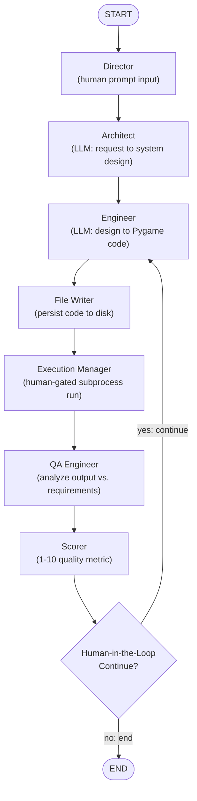

# Agentic Game Studio: A Multi-Agent LangGraph Pipeline for Iterative Game Development

A multi-agent AI system, built with **LangGraph**, that simulates a small software development team — Director, Architect, Engineer, QA, and Scorer — collaborating to design, write, execute, and iteratively refine a fully playable **Chrome Dino-style endless runner game** in Python/Pygame.

Unlike a single-shot "generate a game" prompt, this system models an actual development loop: an LLM-generated design is turned into code, the code is *actually executed* as a subprocess, real runtime output (errors, stdout) is fed back into the next generation pass, and a human sits in the loop at two critical checkpoints — approving execution and deciding whether another refinement iteration is needed.

---

## Why this exists

Most "AI writes a game" demos are one-shot: prompt in, code out, done. This project instead asks: *what does it look like to give an LLM agent a persistent memory, a team of specialized roles, and a real feedback signal (actual program execution) to iterate against?*

It's an exercise in **agentic workflow orchestration** — treating code generation not as a single inference call, but as a stateful, cyclical graph with conditional routing, accumulated memory, and human oversight gates.

---

## Architecture



### The pipeline, role by role

| Node | Role | What it does |
|---|---|---|
| **Director** | Product owner | Captures the initial human objective (e.g. *"Build a Dino Runner game"*) |
| **Architect** | Systems designer | LLM call that turns the request into a concise, numbered high-level design |
| **Engineer** | Developer | LLM call that translates the design **and any prior QA feedback** into raw, executable Pygame code |
| **File Writer** | Execution prep | Persists the generated code to `dino_runner.py` on disk |
| **Execution Manager** | Runtime | Pauses for human approval, then runs the file in an isolated `subprocess` with a timeout, capturing stdout/stderr |
| **QA Engineer** | Tester | Cross-references execution output, the original design, and the code itself into a QA report |
| **Scorer** | Reviewer | Reduces the QA report into a 1–10 quality score |
| **Human-in-the-Loop** | Release manager | Reviews the score and conditionally routes the graph back to the Engineer for another pass, or ends the run |

This is a **cycle, not a pipeline** — the graph loops back to the Engineer node as many times as a human chooses, with each pass carrying forward the full history of prior designs, code, and QA feedback.

---

## Key concepts demonstrated

- **LangGraph `StateGraph`** — nodes, edges, and conditional edges used to model non-linear, cyclical control flow
- **Reducers** — `add_messages` on message-like state fields (`director_messages`, `architect_messages`, `engineer_code`, `qa_feedback`) so every iteration *appends* to history instead of overwriting it; `operator.add` on `iteration_score` to accumulate scores across the run
- **Human-in-the-loop (HITL)** — two explicit human checkpoints: approving code execution, and deciding whether to trigger another refinement iteration
- **Checkpointed memory** — `MemorySaver` + a `thread_id` gives the graph durable, resumable session state across the run
- **Streaming execution** — the compiled graph is invoked with `app.stream()`, so every node's state transition is observed and logged in real time
- **Sandboxed code execution** — generated code is never `exec()`'d in-process; it runs as a separate `subprocess` with a timeout, and only after explicit human approval

---

## Tech stack

- **[LangGraph](https://github.com/langchain-ai/langgraph)** — state graph orchestration, reducers, checkpointing
- **[LangChain](https://github.com/langchain-ai/langchain)** / **`langchain-openai`** — LLM invocation layer
- **OpenAI (`ChatOpenAI`)** — powers the Architect and Engineer agents
- **Pygame** — runtime/rendering engine for the generated game
- **Python `subprocess`** — isolated, timeout-bounded execution of generated code
- **Databricks** — AI and Data platform of choice

---

## Project structure

```
.
├── gamerag.ipynb     # Main notebook: state schema, agent nodes, graph, invocation
├── dino_runner.py          # Latest AI-generated game (output artifact, overwritten each iteration)
├── highscore.txt           # Persisted high score for the generated game
└── README.md
```

---

## The state schema

```python
class GameState(TypedDict):
    director_messages: Annotated[list, add_messages]
    architect_messages: Annotated[list, add_messages]
    engineer_code: Annotated[list, add_messages]
    qa_feedback: Annotated[list, add_messages]
    current_actor: str
    iteration: int
    iteration_score: Annotated[List[int], operator.add]
    file_saved: bool
```

Every message-bearing field is additive, so at any point in the run you can inspect the *entire* design/code/QA history, not just the latest turn — this is what lets the Engineer node ground each rewrite in accumulated feedback rather than starting from scratch.

---

## Running it

1. **Install dependencies**
   ```bash
   pip install langgraph langchain langchain-openai pygame
   ```
2. **Set your API key** in the notebook:
   ```python
   os.environ["OPENAI_API_KEY"] = "your-key-here"
   ```
3. **Run the notebook cells in order.** The graph will prompt you in the terminal at two points:
   - `Awaiting Director Prompt:` — describe the game you want built
   - `Run the generated game? (y/n):` — approve execution of the generated code
   - `Trigger a new iteration to refine the code? (y/n):` — after seeing the score, choose whether to loop back to the Engineer
4. **Play the generated game** directly:
   ```bash
   python dino_runner.py
   ```

### Controls (generated game)

| Key | Action |
|---|---|
| `Space` / `Up` | Jump |
| `Down` | Duck |

The game includes flying obstacles (pterodactyls), ground obstacles (cacti), gravity-based jump physics, and a persisted high-score file (`highscore.txt`).

---

## Sample run

```
--- STARTING WORKFLOW ---
========== ITERATION 0 ==========
Architect is generating design...

===== ARCHITECT =====
{'architect_messages': [...], 'current_actor': 'architect'}

Engineer is writing code...

===== ENGINEER =====
{'engineer_code': [...], 'current_actor': 'engineer'}

[File saved: dino_runner.py]

===== CODE EXECUTION =====
Run the generated game? (y/n): y
Execution Successful.

System Score for this iteration: 8/10
Trigger a new iteration to refine the code? (y/n): n
```

---

## Known limitations / future work

- **Scoring is currently static** — `score_node` returns a fixed placeholder score rather than an LLM-derived judgment of code quality; a natural next step is prompting the LLM to score based on the QA report content.
- **`iteration` is tracked in state but not yet incremented** between loops — worth wiring up for accurate iteration counts in logs/telemetry.
- **QA subgraph (planned extension)** — a natural extension of this architecture is decomposing the single QA node into an internal subgraph (`syntax_checker_node` → `logic_tester_node` → `performance_auditor_node`) that still presents as one node to the parent graph, giving finer-grained, multi-stage quality checks without changing the outer pipeline shape.
- **Single-file output** — the Engineer currently regenerates the entire game file each iteration rather than patching specific sections; incremental diff-based edits would reduce regression risk across iterations.

---
